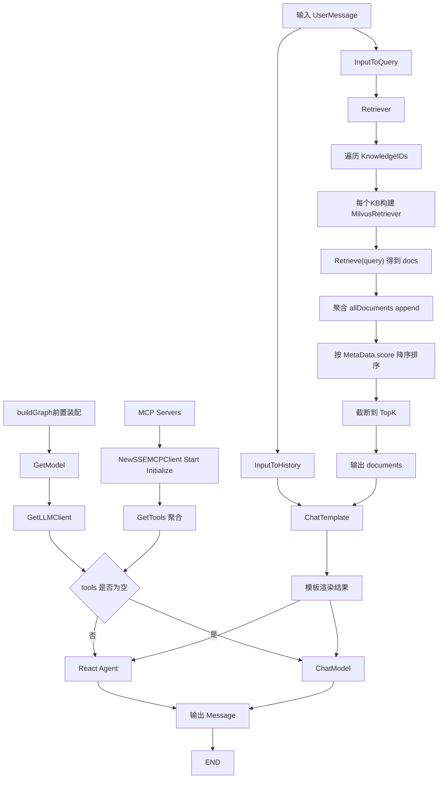

# Agent `buildGraph` 流程图（Mermaid）

## 节点数据传递与聚合说明

1. `START` 输入同一份 `UserMessage`，并行分发到 `InputToQuery` 与 `InputToHistory`。
2. `InputToQuery` 只提取 `query`，传给 `Retriever` 做向量检索。
3. `Retriever` 在 `MultiKBRetriever` 内部执行“跨知识库聚合”：
   - 按 `KnowledgeIDs` 循环检索；
   - 每个知识库各自召回文档；
   - 统一 `append` 到 `allDocuments`；
   - 按 `score` 排序后做全局 `TopK` 截断。
4. `InputToHistory` 产出 `map`，其中 `history/query/date` 作为 `ChatTemplate` 的变量输入。
5. `Retriever` 输出通过 `WithOutputKey("documents")` 注入模板变量 `documents`，与 `history/query` 在 `ChatTemplate` 聚合。
6. `ChatTemplate` 生成最终消息数组后：
   - 若存在 MCP tools：进入 `React Agent`（可多步工具调用，`MaxStep=10`）；
   - 否则：直接进入 `ChatModel` 单步生成。
7. 两条分支最终统一输出 `*schema.Message` 到 `END`。

## 图与代码对应关系

- 图中主流程对应 `buildGraph`：`internal/service/agent.go`。
- 聚合检索细节对应 `MultiKBRetriever.Retrieve`：`internal/component/retriever/milvus/multi_retriever.go`。
